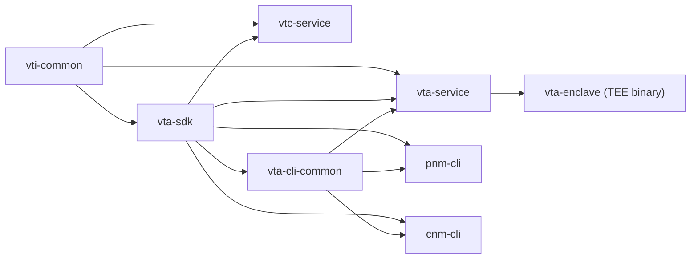

# Verifiable Trust Infrastructure

[](https://github.com/OpenVTC/verifiable-trust-infrastructure)
[](LICENSE)

A Verifiable Trust Agent (VTA) is an always-on service that manages cryptographic
keys, DIDs, and access-control policies for a
[Verifiable Trust Community](https://www.firstperson.network/white-paper). This
repository contains the VTA service, a shared SDK, the Verifiable Trust Community
service (VTC), and the Personal / Community Network Manager CLIs (PNM / CNM).

## Table of Contents

- [Overview](#overview)
- [Architecture](#architecture)
- [Prerequisites](#prerequisites)
- [Getting Started](#getting-started)
- [Example: Creating a New Application Context](#example-creating-a-new-application-context)
- [Documentation](#documentation)

## Overview

The repository is a Rust workspace:

| Crate              | Description                                                                                              |
| ------------------ | -------------------------------------------------------------------------------------------------------- |
| **vti-common**     | Shared foundation: auth, ACL, store abstraction (local + vsock), error types, config, telemetry sink.    |
| **vta-sdk**        | Public SDK: types, REST + DIDComm client, sealed-transfer, DID-template engine, attestation verification. |
| **vta-cli-common** | Shared CLI command implementations used by both `pnm` and `cnm`.                                          |
| **vta-service**    | VTA library and local/dev binary. Routes, operations, setup wizards, DIDComm protocol management.        |
| **vta-enclave**    | VTA binary for AWS Nitro Enclaves (TEE bootstrap, KMS, vsock-store, attestation). Linux-only.            |
| **vtc-service**    | Verifiable Trust Community service (community lifecycle, separate JWT audience).                         |
| **pnm-cli**        | Personal Network Manager — single-VTA operator CLI.                                                      |
| **cnm-cli**        | Community Network Manager — multi-community operator CLI.                                                |
| **didcomm-test**   | Standalone DIDComm connectivity test harness (development tool, not published).                          |

### Crate dependencies

Dependencies flow strictly downward — no cycles.



`vti-common` is referenced from the diagram for clarity; it has no internal
workspace dependencies of its own. Same for `vta-sdk`. Both are leaf crates
that fan upward.

## Architecture

The VTA is built on Axum with an embedded fjall key-value store for
persistence. Cryptographic keys derive from a single BIP-39 mnemonic via
BIP-32 Ed25519 derivation, and the master seed is stored in a pluggable
backend (OS keyring by default; see [feature flags](docs/02-operating/feature-flags.md)).

### Key concepts

- **Sealed-transfer wire format** — every secret-bearing transfer between the
  VTA, integrations, and CLIs moves as an HPKE-AEAD envelope
  (X25519-HKDF-SHA256 + ChaCha20-Poly1305) wrapped in OpenPGP-style ASCII armor
  with a CRC24 line checksum. Producer assertions tie the bundle to a
  Nitro attestation, a DID signature, or an out-of-band digest. One format,
  one seal/open path. See [`vta-sdk::sealed_transfer`](vta-sdk/src/sealed_transfer)
  and [`docs/01-concepts/security-model.md`](docs/01-concepts/security-model.md).
- **DID templates** — declarative JSON describing the shape of a DID
  document with `{TOKEN}` placeholders. The VTA renders templates server-side,
  filling in keys it just minted plus caller-supplied variables. Five built-ins
  ship with the SDK (`didcomm-mediator`, `vta-admin`, `webvh-control`,
  `webvh-daemon`, `webvh-server`); operators can upload more. See
  [`docs/03-integrating/did-templates.md`](docs/03-integrating/did-templates.md).
- **Provision-integration** — the canonical flow for bootstrapping any
  integration (mediator, webvh host, application). A holder posts a VP-framed
  `BootstrapRequest` naming a template + variables; the VTA mints keys, renders
  the template, registers the holder in the ACL, issues a
  `VtaAuthorizationCredential` (W3C VC), seals the bundle to the holder's
  X25519 key, and returns armored output. Works over offline file, REST, and
  DIDComm transports through the same library function. See
  [`docs/03-integrating/provision-integration.md`](docs/03-integrating/provision-integration.md).
- **DIDComm protocol management** — operators can enable, disable, or migrate
  the DIDComm protocol surface on a *running* VTA without rebuilding it,
  re-issuing admin credentials, or rotating verification keys. Mediator
  changes go through a fjall-persisted, restart-resilient drain set so
  in-flight messages from senders with stale DID-doc caches keep landing while
  the new mediator picks up traffic. See
  [`docs/03-integrating/didcomm-protocol-management.md`](docs/03-integrating/didcomm-protocol-management.md)
  for the operator guide and
  [`docs/05-design-notes/didcomm-protocol-management.md`](docs/05-design-notes/didcomm-protocol-management.md)
  for the design notes.
- **Authentication** — challenge-response over either REST or DIDComm v2,
  issuing short-lived (15-minute) EdDSA JWT access tokens with a 24-hour
  refresh token. Refresh tokens rotate on every `/auth/refresh` (RFC 6749
  §10.4); replay surfaces as "refresh token not found".

### Stack

| Layer          | Technology                                                                                                |
| -------------- | --------------------------------------------------------------------------------------------------------- |
| Web framework  | Axum 0.8                                                                                                  |
| Async runtime  | Tokio                                                                                                     |
| Storage        | fjall (embedded LSM key-value store)                                                                      |
| Cryptography   | ed25519-dalek, ed25519-dalek-bip32, hpke (X25519 + ChaCha20-Poly1305), aws-lc-rs (KMS CMS)                |
| DID resolution | affinidi-did-resolver-cache-sdk                                                                           |
| DIDComm        | affinidi-tdk 0.7, affinidi-messaging-didcomm-service                                                      |
| JWT            | jsonwebtoken (EdDSA / Ed25519)                                                                            |
| Seed storage   | OS keyring, AWS / GCP / Azure secret managers, HashiCorp Vault, or KMS-TEE — see [Secret-storage backends](docs/02-operating/secret-backends.md) |

For a deeper architectural walkthrough start with
[`docs/01-concepts/overview.md`](docs/01-concepts/overview.md). For Cargo
feature configuration see [`docs/02-operating/feature-flags.md`](docs/02-operating/feature-flags.md).

## Prerequisites

- **Rust 1.94.0+** (edition 2024)
- **OS keyring support** (when using the default `keyring` feature) — the
  master seed is stored in your platform's credential manager:
  - macOS: Keychain
  - Linux: secret-service (e.g. GNOME Keyring)
  - Windows: Credential Manager

## Getting Started

### Build

```sh
cargo build --workspace
```

### Run the setup wizard

The setup wizard bootstraps a new VTA instance. It is gated by the `setup`
feature flag (on by default for the local `vta` binary).

```sh
# Interactive
cargo run --package vta-service -- setup

# Non-interactive (CI / sealed images / unattended bootstrap)
cargo run --package vta-service -- setup --from setup.toml
```

See [`docs/02-operating/non-interactive-setup.md`](docs/02-operating/non-interactive-setup.md)
and [`docs/02-operating/examples/vta-setup.example.toml`](docs/02-operating/examples/vta-setup.example.toml)
for the `--from` schema.

The wizard mints a fresh BIP-39 mnemonic, derives the VTA's signing and
key-agreement keys, creates the `vta` (and optionally `mediator`) trust
context, and writes a `config.toml`. When DIDComm is enabled it also creates
a mediator DID via the `didcomm-mediator` template. When REST is enabled it
prompts for the **VTA REST URL** that the DID document will publish as a
service endpoint.

> **Save the mnemonic.** It is the root of all key material. Run
> `pnm backup export` after the first admin connects to capture an encrypted
> backup.

### Start the VTA service

```sh
cargo run --package vta-service
```

The service listens on the host and port chosen during setup (defaults to
`0.0.0.0:8100`). Verify it is running:

```sh
# Personal Network Manager (single VTA)
cargo run --package pnm-cli -- health --url http://localhost:8100

# Community Network Manager (multi-community)
cargo run --package cnm-cli -- health
```

### Authenticate a CLI

There are two onboarding paths, depending on whether the VTA is running
inside a Nitro Enclave.

**Cold start (non-TEE)** — the VTA is configured with an `admin_did` ahead
of first boot. The PNM CLI mints an ephemeral `did:key` locally; the
operator pastes that DID into the VTA's `admin_did` field; the VTA boots;
PNM completes the challenge-response on first authenticated call and
auto-rotates to a fresh `did:key`, deleting the temp DID. One-line
operator UX:

```sh
cargo run --package pnm-cli -- setup --name my-vta
```

The wizard walks through it interactively. For automated provisioners (a
Terraform module, a CI script) there is a non-interactive two-phase form
documented at [`docs/02-operating/cold-start.md`](docs/02-operating/cold-start.md):
phase 1 emits the temp DID as JSON on stdout, phase 2 finishes once the
VTA is up.

**TEE Mode B (Nitro Enclave)** — for a fresh enclave whose
`/bootstrap/request` carve-out is still open. The PNM CLI verifies the
COSE_Sign1 attestation document, the cert chain back to the AWS Nitro
root, and the PCR measurements before accepting the sealed admin
credential the enclave returns. The carve-out closes permanently on first
success.

```sh
cargo run --package pnm-cli -- bootstrap connect \
    --vta-url https://enclave.example.com
```

Both paths import the resulting credential into the OS keyring, perform a
challenge-response handshake, and cache the access + refresh tokens.
Subsequent commands authenticate automatically. See
[`pnm-cli/README.md`](pnm-cli/README.md) for the full setup-wizard surface.

## Example: Creating a New Application Context

The `contexts bootstrap` command creates a context and generates credentials
for its first admin in a single step:

```sh
cargo run --package cnm-cli -- contexts bootstrap \
    --id myapp \
    --name "My Application" \
    --admin-label "MyApp Admin"
```

Give the resulting credential to the context administrator so they can
authenticate:

```sh
cargo run --package cnm-cli -- auth login <context-admin-credential>
```

Follow-up commands the context admin can now run:

```sh
# List all contexts visible to this credential (machine-readable)
cargo run --package cnm-cli -- --json contexts list | jq

# Create an Ed25519 signing key in the new context
cargo run --package cnm-cli -- keys create --key-type ed25519 \
    --context myapp --label "Signing Key"

# List keys
cargo run --package cnm-cli -- keys list
```

See [PNM CLI](pnm-cli/README.md) and [CNM CLI](cnm-cli/README.md) for command
references.

## Documentation

The full documentation tree is organized as a book — see
[`docs/README.md`](docs/README.md) for the index. Quick links by topic:

- **Concepts** — [Overview](docs/01-concepts/overview.md) ·
  [Architecture](docs/01-concepts/architecture.md) ·
  [Security model](docs/01-concepts/security-model.md) ·
  [TEE architecture](docs/01-concepts/tee-architecture.md)
- **Operating** — [Cold-start](docs/02-operating/cold-start.md) ·
  [Non-interactive setup](docs/02-operating/non-interactive-setup.md) ·
  [Secret-storage backends](docs/02-operating/secret-backends.md) ·
  [Feature flags](docs/02-operating/feature-flags.md)
- **Integrating** — [Integration guide](docs/03-integrating/integration-guide.md) ·
  [DIDComm protocol](docs/03-integrating/didcomm-protocol.md) ·
  [DIDComm protocol management](docs/03-integrating/didcomm-protocol-management.md) ·
  [DID templates](docs/03-integrating/did-templates.md) ·
  [Provision-integration](docs/03-integrating/provision-integration.md) ·
  [WebVH update](docs/03-integrating/did-webvh-update.md)
- **Reference** — [BIP-32 paths](docs/04-reference/bip32-paths.md) ·
  [CLI style](docs/04-reference/cli-style.md)
- **Design notes** —
  [DIDComm protocol management](docs/05-design-notes/didcomm-protocol-management.md) ·
  [Deferred VTA-DID setup](docs/05-design-notes/pnm-setup-deferred-vta-did.md) ·
  [Store migration](docs/05-design-notes/store-migration.md)
- [First Person Project White Paper](https://www.firstperson.network/white-paper)
