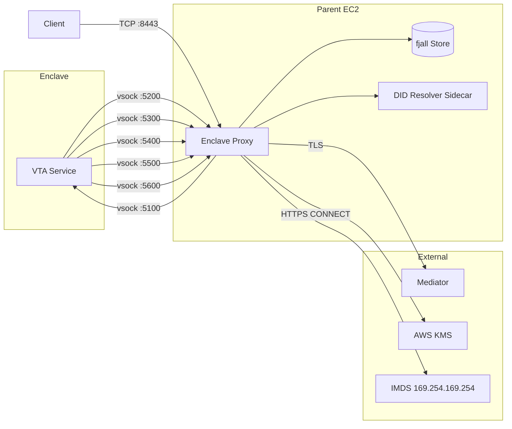

# VTA Security Architecture

## Overview

The VTA implements a defense-in-depth security model with eight layers of
protection when deployed in TEE mode. Non-TEE deployments use layers 4-8;
TEE deployments add hardware isolation, KMS-backed secrets, and encrypted
storage.

For TEE implementation details (KMS bootstrap code, encrypted store layer,
config changes), see [TEE Enclave Security Design](tee-architecture.md).

## Security Layers

### Layer 1: Hardware Isolation (Nitro Enclave)
- Enclave runs in isolated memory -- parent EC2 cannot read enclave RAM
- No direct network access -- all I/O through vsock channels
- `/dev/nsm` provides hardware-backed attestation and entropy
- Hypervisor enforces isolation (not software-based)

### Layer 2: KMS-Backed Secrets
- Master seed generated inside enclave using NSM-backed random
- Encrypted with AWS KMS before leaving enclave memory
- KMS key policy requires PCR0 (image hash) + PCR8 (signing cert)
- Only the exact enclave image + signing cert can decrypt secrets
- JWT signing key also KMS-encrypted with fingerprint verification

### Layer 3: Encrypted Storage
- All fjall keyspace values encrypted with AES-256-GCM
- Storage key derived from master seed via HKDF-SHA256
- Deterministic derivation -- same seed produces same key across restarts
- Keys stored in plaintext for prefix scans; values always encrypted
- Each value: `[12-byte random nonce][ciphertext][16-byte auth tag]`

### Layer 4: Configuration Locking
- When KMS bootstrap is active, environment variable overrides are blocked
- Only `VTA_LOG_LEVEL` and `VTA_LOG_FORMAT` remain configurable
- Prevents parent-side attacker from injecting `VTA_DID`, `VTA_AUTH_JWT_SIGNING_KEY`, etc.
- Config baked into EIF at build time -- immutable after signing

### Layer 5: Identity & Access Control
- DID-based authentication via challenge-response (Ed25519 signatures)
- Role hierarchy: super-admin > admin > initiator > application > reader > monitor
- Action classification: every endpoint is classified as read, write, or manage
  - **Reader**: read-only access to business data (keys, contexts, DIDs) within allowed contexts
  - **Application**: can sign and write to cache (write actions)
  - **Initiator**: can manage ACL entries and credentials (manage actions)
  - **Admin**: full key/DID/audit management within contexts
  - **Monitor**: infrastructure-only (metrics, health)
- Context scoping restricts access to assigned application contexts
- DID method whitelist blocks unsafe `did:web` in TEE mode
- Session state machine prevents challenge replay

### Layer 6: VTA Seal
- After initial admin bootstrap, VTA is "sealed"
- All offline CLI commands (key management, ACL changes) disabled
- Management only via authenticated REST/DIDComm
- Unsealing requires challenge-response proof of admin key ownership
- In TEE mode, seal marker is AES-256-GCM encrypted in storage

Operator-facing detail (when the seal is set, when it gets in the way,
how to unseal, and the bootstrap-then-seal-last pattern that avoids
the unseal dance) lives in
[`02-operating/seal-and-unseal.md`](../02-operating/seal-and-unseal.md).

### Layer 7: Network Controls
- Three vsock channels with strict purpose separation:
  - Inbound REST (port 5100): client requests to VTA
  - Outbound mediator (port 5200): DIDComm messaging with TLS
  - Outbound HTTPS (port 5300): allowlisted destinations only
- HTTPS CONNECT proxy validates every request against allowlist
- Non-CONNECT requests rejected with 405 Method Not Allowed
- Connection limits prevent resource exhaustion
- Request body size limits protect enclave memory

#### Enclave Proxy Architecture



### Layer 8: Audit & Observability
- Structured audit events at target "audit" -- never suppressed by log level
- All security operations logged: auth, ACL changes, key operations, exports
- Health endpoint split: minimal (public) vs. detailed (authenticated)
- Graceful shutdown with store persistence guarantees

## Key Lifecycle

```
1. First Boot (inside enclave):
   ┌─────────────────────────────────────────┐
   │ Generate 256-bit entropy (/dev/nsm)     │
   │ → BIP-39 mnemonic (24 words)            │
   │ → BIP-32 master seed (512 bits)         │
   │ → KMS Encrypt(seed) → seed.enc          │
   │ → Generate JWT key (256 bits)            │
   │ → KMS Encrypt(jwt) → jwt.enc            │
   │ → HKDF(seed, salt) → storage key        │
   │ → Start mnemonic export window           │
   └─────────────────────────────────────────┘

2. Key Derivation (BIP-32 hierarchy):
   m/26'/2'/N'/K'
   │       │  │
   │       │  └── Key counter (sequential)
   │       └───── Context index (sequential)
   └────────────── FPN reserved prefix

3. Subsequent Boot:
   ┌─────────────────────────────────────────┐
   │ Read seed.enc + jwt.enc from EBS        │
   │ → KMS Decrypt(seed.enc) → seed          │
   │ → KMS Decrypt(jwt.enc) → jwt key        │
   │ → Verify JWT fingerprint (SHA-256)       │
   │ → HKDF(seed, salt) → same storage key   │
   │ → Open encrypted fjall store             │
   │ → Resume operations                      │
   └─────────────────────────────────────────┘

4. Key Rotation:
   ┌─────────────────────────────────────────┐
   │ Generate new seed (or import mnemonic)   │
   │ → Mark old seed generation as "retired"  │
   │ → New keys derived from new seed         │
   │ → Old keys remain readable (old seed)    │
   │ → Re-encrypt imported secrets with new   │
   │   seed-derived KEK                       │
   └─────────────────────────────────────────┘

5. Imported Key (external, non-BIP-32):
   ┌─────────────────────────────────────────┐
   │ Receive private key via REST (JWE-      │
   │   wrapped with ephemeral ECDH-ES) or    │
   │   DIDComm (E2E encrypted)               │
   │ → Validate key type + length            │
   │ → Derive public key, verify consistency │
   │ → HKDF(seed, salt) → KEK               │
   │ → AES-256-GCM(KEK, nonce, key,         │
   │     AAD=key_id:key_type)                │
   │ → Store ciphertext in imported_secrets  │
   │ → KeyRecord with origin=imported        │
   │                                          │
   │ On revoke: overwrite blob → delete       │
   │ On seed rotation: re-encrypt all         │
   │ On backup: plaintext inside encrypted    │
   │   envelope (Argon2id + AES-256-GCM)      │
   └─────────────────────────────────────────┘
```

## Authentication Flow

```
Client                          VTA (in enclave)
  │                                  │
  │  POST /auth/challenge {did}      │
  │ ─────────────────────────────►   │
  │                                  │ ← Check DID whitelist
  │                                  │ ← Check DID in ACL
  │                                  │ ← Generate 32-byte nonce
  │                                  │ ← Store nonce (replay detection)
  │                                  │ ← Generate attestation report
  │  {sessionId, challenge,          │
  │   tee_attestation}               │
  │ ◄─────────────────────────────   │
  │                                  │
  │  (client verifies attestation)   │
  │  (client signs challenge)        │
  │                                  │
  │  POST /auth/ (DIDComm packed)    │
  │ ─────────────────────────────►   │
  │                                  │ ← Unpack DIDComm (verify sig)
  │                                  │ ← Validate session state
  │                                  │ ← Verify challenge match
  │                                  │ ← Check challenge TTL
  │                                  │ ← Issue JWT (EdDSA signed)
  │  {accessToken, refreshToken}     │
  │ ◄─────────────────────────────   │
  │                                  │
  │  GET /keys (Bearer token)        │
  │ ─────────────────────────────►   │
  │                                  │ ← Validate JWT signature
  │                                  │ ← Check expiry, role, contexts
  │  {keys: [...]}                   │
  │ ◄─────────────────────────────   │
```

## Threat Model

### Trust Boundaries

```
┌──────────────────────────────────┐
│        Untrusted Zone            │
│  (Internet, external clients)    │
└──────────────┬───────────────────┘
               │ HTTPS (TLS)
┌──────────────┴───────────────────┐
│     Semi-Trusted Zone            │
│  (Parent EC2 instance)           │
│  - enclave-proxy                 │
│  - EBS volumes (ciphertext only) │
│  - IAM role (limited)            │
└──────────────┬───────────────────┘
               │ vsock (no network)
┌──────────────┴───────────────────┐
│       Trusted Zone               │
│  (Nitro Enclave)                 │
│  - VTA service                   │
│  - Plaintext secrets (memory)    │
│  - Encrypted storage (fjall)     │
│  - /dev/nsm (attestation)        │
└──────────────────────────────────┘
```

### Adversary Model

#### A1: Network Attacker
**Capabilities:** Intercept/modify network traffic between clients and the VTA.
**Mitigations:**
- TLS termination on parent proxy (inbound)
- DIDComm authenticated encryption (end-to-end)
- HTTPS CONNECT proxy with allowlist (outbound)

#### A2: Compromised Parent Instance
**Capabilities:** Root access to the EC2 host. Can read EBS, modify proxy, inject env vars.
**Mitigations:**
- Nitro Enclave memory isolation (hypervisor-enforced)
- KMS key policy with PCR pinning (PCR0 + PCR8)
- Environment variable locking when KMS bootstrap active
- Storage encrypted with AES-256-GCM (key only in enclave memory)
- Attestation reports prove enclave identity to clients
- DID method whitelist blocks `did:web` through untrusted resolver

#### A3: Supply Chain Attacker
**Capabilities:** Modify the enclave image or signing certificate.
**Mitigations:**
- PCR0 (image hash) pinned in KMS key policy
- PCR8 (signing cert hash) pinned in KMS key policy
- EIF signing with P-384 key (stored offline)
- KMS Decrypt fails if PCRs don't match -- secrets inaccessible

#### A4: Insider with Admin Access
**Capabilities:** Valid admin DID credentials. Can manage keys, ACL, config.
**Mitigations:**
- Role-based access control (admin, initiator, application)
- Context scoping limits admin to assigned contexts
- Structured audit logging (target: "audit") for all admin operations
- VTA seal prevents offline CLI manipulation after deployment
- Mnemonic export is time-limited and one-time only

#### A5: Denial of Service
**Capabilities:** Flood endpoints with requests.
**Mitigations:**
- Request body size limits (1MB default)
- Connection limits on proxy (semaphore-based)
- Store operation timeouts (30s)
- Rate limiting on auth endpoints (recommended via reverse proxy)

### Attack Trees

#### AT1: Steal Master Seed
```
Steal master seed
├── Read enclave memory → BLOCKED (Nitro hypervisor)
├── Decrypt seed.enc from EBS
│   ├── Obtain KMS Decrypt access
│   │   ├── Modify KMS key policy → requires admin MFA
│   │   └── Spoof PCR values → BLOCKED (hardware-measured)
│   └── Brute-force AES-256 → computationally infeasible
├── Export mnemonic via API
│   ├── Obtain super-admin JWT
│   │   ├── Steal JWT signing key → only in enclave memory
│   │   └── Brute-force Ed25519 → computationally infeasible
│   └── Bypass time window → entropy zeroed after window
└── Intercept during KMS Decrypt
    ├── MITM vsock proxy → TLS to KMS (webpki-roots)
    └── Read KMS response → TLS encrypted (TODO: Recipient param)
```

#### AT2: Impersonate VTA
```
Impersonate VTA
├── Forge attestation report → requires /dev/nsm (enclave-only)
├── Replace enclave image
│   └── KMS Decrypt fails (PCR0 mismatch) → no secrets
├── Run VTA outside enclave
│   └── tee.mode = "required" → refuses to start
└── Inject config via env vars
    └── KMS lock blocks all security-relevant env overrides
```

#### AT3: Privilege Escalation
```
Escalate privileges
├── Modify ACL via CLI → BLOCKED by VTA seal
├── Tamper with fjall store directly
│   └── AES-256-GCM encrypted → requires storage key
├── Forge JWT token
│   └── Ed25519 signing key only in enclave memory
├── Replay auth challenge
│   └── Nonce stored in session KS, state machine prevents replay
└── Create admin via API
    └── Requires existing admin/initiator JWT with Manage role
```

### Residual Risks

| Risk | Severity | Status | Notes |
|------|----------|--------|-------|
| KMS Recipient parameter not implemented | Medium | TODO | Parent could theoretically intercept KMS Decrypt response; mitigated by TLS + key policy |
| No per-IP rate limiting in VTA | Low | Mitigated | Deploy behind reverse proxy with rate limiting |
| Health endpoint information disclosure | Low | Fixed | Split into minimal (public) and detailed (auth required) |
| DID resolver through parent | Low | Mitigated | Whitelist blocks `did:web`; `did:key` and `did:webvh` are self-certifying |

## Cryptographic Inventory

| Algorithm | Purpose | Key Size | Standard |
|-----------|---------|----------|----------|
| Ed25519 | Signing, authentication | 256-bit | RFC 8032 |
| X25519 | Key agreement (DIDComm) | 256-bit | RFC 7748 |
| AES-256-GCM | Storage encryption | 256-bit | NIST SP 800-38D |
| HKDF-SHA256 | Storage key derivation | 256-bit | RFC 5869 |
| BIP-39 | Mnemonic seed generation | 256-bit entropy | BIP-39 |
| BIP-32 | Hierarchical key derivation | Ed25519 | BIP-32/SLIP-0010 |
| SHA-256 | JWT fingerprint, nonce hashing | 256-bit | FIPS 180-4 |
| ECDSA P-384 | EIF signing (Nitro) | 384-bit | FIPS 186-4 |
| COSE_Sign1 | Attestation reports (Nitro) | ES384 | RFC 8152 |

## Deployment Security Checklist

- [ ] TEE mode set to `required` (not `optional` or `simulated`)
- [ ] KMS key policy pinned to PCR0 + PCR8
- [ ] EIF signed with offline P-384 key
- [ ] IAM role limited to `kms:GenerateDataKey` + `kms:Decrypt` (both attestation-gated)
- [ ] KMS admin requires MFA for policy changes
- [ ] DID method whitelist: `["did:key", "did:webvh"]`
- [ ] Reverse proxy with TLS, rate limiting, CORS policy
- [ ] Mnemonic exported and stored securely offline
- [ ] VTA sealed after admin bootstrap
- [ ] Audit logs shipped to SIEM
- [ ] CloudTrail alerts on KMS policy changes
- [ ] Health endpoint accessible only to monitoring systems
