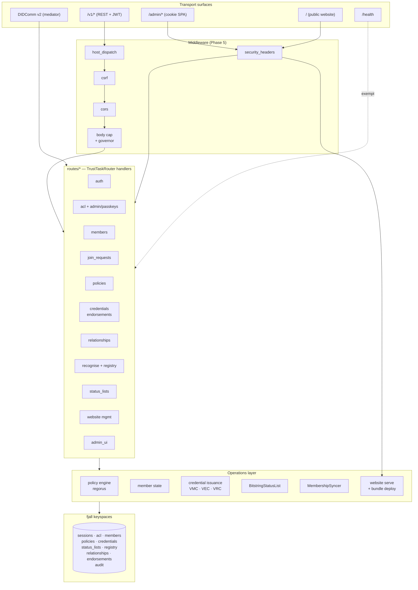
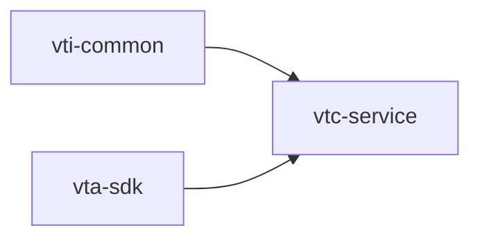
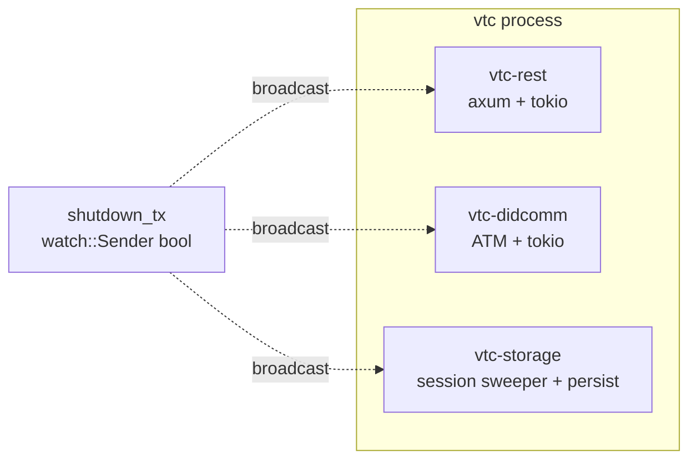
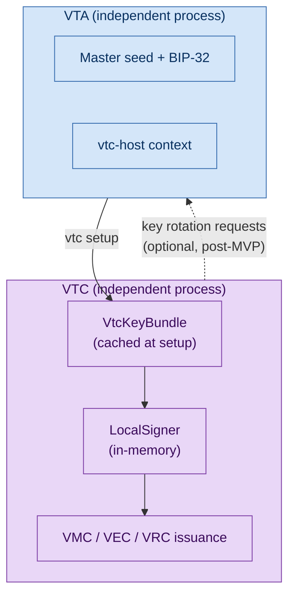

# VTC architecture

How `vtc-service` is laid out, what each module owns, and how it
maps onto the runtime surfaces an operator sees.

## At a glance

## Crate dependencies

The VTC is the leaf crate in the workspace — nothing depends on it.

`vti-common` provides JWT auth, the `Store`/`KeyspaceHandle` enum,
audit envelopes, error types, config types, and the
`TrustTaskRouter` glue. `vta-sdk` provides the
`provision-integration` client (used at setup), VC/VP helpers,
sealed-transfer, and protocol types shared with the VTA.

## Module layout

| Module | Purpose |
|---|---|
| `acl/` | Role enum + per-DID ACL entries + storage. The VTC extends the shared `vti_common::acl::Role` with VTC-specific roles (Moderator, Issuer, Member, custom). |
| `admin_ui/` | `include_dir!`-baked admin SPA (HTML/CSS/JS at `vtc-service/admin-ui/`). |
| `auth/` | Session machinery + JWT keys + cookie + bearer extractors (`AuthClaims`, `ManageAuth`, `AdminAuth`). |
| `community/` | Profile CRUD + community-level config. |
| `config.rs` | All `AppConfig` types (server, routing, auth, registry, renewal, website, admin_ui, …). |
| `credentials/` | VMC / VEC / VRC / custom endorsement builders + `LocalSigner` (cached signer wrapping the VTA-minted key). |
| `did_key.rs` | `did:key` helpers (multibase + multicodec). |
| `endorsement_types/` | Operator-uploaded endorsement type registry. |
| `endorsements/` | Custom endorsement issuance + revocation + storage. |
| `install/` | Install token signer + state machine (one-shot WebAuthn ceremony). |
| `join/` | Join request lifecycle + retention. |
| `keys/` | Secret-store integration (keyring / AWS / GCP / Azure / inline / plaintext). |
| `members/` | Member row + relationships + personhood lifecycle + DID rotation. |
| `messaging.rs` | DIDComm thread + ATM wiring. |
| `policy/` | `regorus`-backed engine, policy-id storage, default policies, evaluation helpers. |
| `recognition/` | Foreign-credential verifier (status list + registry membership) for cross-community session minting. |
| `registry/` | Trust-registry client + `RegistryHealth` + `MembershipSyncer` + RTBF batching. |
| `relationships/` | VRC primary keyspace + per-DID secondary index. |
| `routes/` | All axum handlers; one file per resource. `routes/mod.rs` wires the `TrustTaskRouter`. |
| `routing/` | Phase 5 middleware: `host_dispatch`, `csrf`, `security_headers`. |
| `server.rs` | `AppState` + binary entry point + three OS threads (REST / DIDComm / storage). |
| `setup/` | `vtc setup` wizard + the sealed-bundle opener. |
| `status_list/` | BitstringStatusList minting + slot allocator + storage. |
| `webauthn.rs` | RP-ID + algorithm restriction + ceremony helpers. |
| `website/` | Public website surface — filesystem serve handler, bundle deploy, FD cache, path safety, default in-tree landing page. |

## AppState + fjall keyspaces

Every keyspace handle on `AppState` is opened once at boot and
cloned cheaply into handlers. The complete list:

| Keyspace | Purpose |
|---|---|
| `sessions` | Auth sessions + refresh-token reverse index |
| `acl` | Per-DID `VtcAclEntry` rows |
| `community` | Community profile singleton |
| `config` | Operator-mutable config overrides |
| `passkey` | WebAuthn enrolment state |
| `install` | Install token claim ceremony state |
| `members` | Member roster + personhood flag |
| `join_requests` | Pending + decided join requests |
| `policies` | Uploaded Rego policy revisions |
| `active_policies` | Per-purpose pointer to the active revision |
| `status_lists` | BitstringStatusList state per purpose |
| `registry_records` | Local mirror of published trust-registry rows |
| `sync_queue` | `MembershipSyncer` queue |
| `sync_cursor` | Audit-tail boot-replay cursor |
| `relationships` | VRC primary rows |
| `relationships_by_did` | VRC secondary index (`<did>:<vrc-id>`) |
| `endorsement_types` | Operator-uploaded type registry |
| `endorsements` | Issued custom endorsements |
| `audit` | HMAC-actor-hashing audit envelopes |
| `audit_key` | HMAC audit key + rotation history |

## Three-thread runtime

`vtc-service` runs three named OS threads, mirroring the VTA's
layout:

- **vtc-rest** serves HTTP on `0.0.0.0:8200`.
- **vtc-didcomm** runs the DIDComm mediator subscription + handler
  dispatch.
- **vtc-storage** runs the session sweeper and flushes fjall on
  shutdown.

A `tokio::sync::watch` channel coordinates graceful shutdown:
SIGINT/SIGTERM, REST-thread panic, or
`POST /v1/admin/config/restart` all flip the channel and every
thread drains.

## Relationship to the VTA

The VTC is **not** standalone — it's provisioned by a VTA at setup
and continues to depend on the VTA for key custody decisions like
rotation. The runtime relationship:

The `VtcKeyBundle` is sealed at the VTA and opened once at setup;
afterwards it lives in the configured secrets backend (OS keyring
by default). Every credential the VTC issues is signed in-process
with the cached signer.

## See also

- [VTC spec](../05-design-notes/vtc-mvp.md) — full §1–§19 design
  rationale.
- [Community lifecycle](community-lifecycle.md) — what the
  members/policies/credentials surfaces actually do.
- [VTA architecture](../01-concepts/architecture.md) — the shared
  workspace shape.
