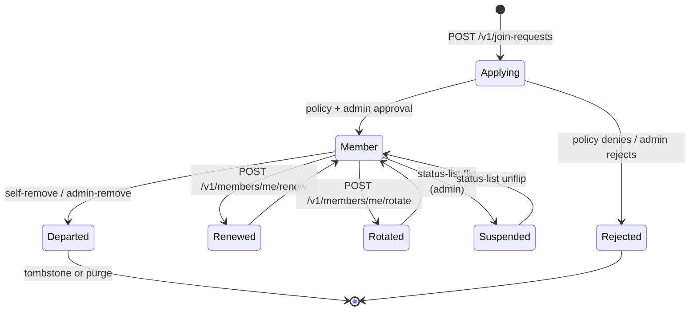
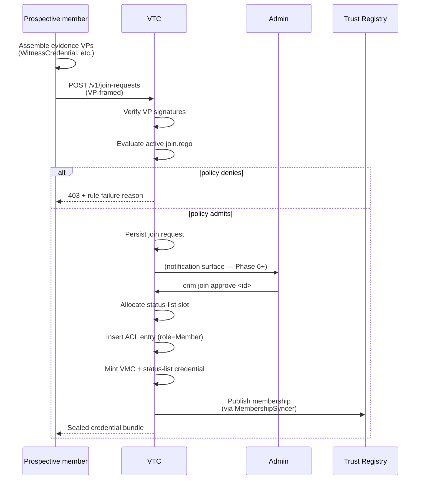
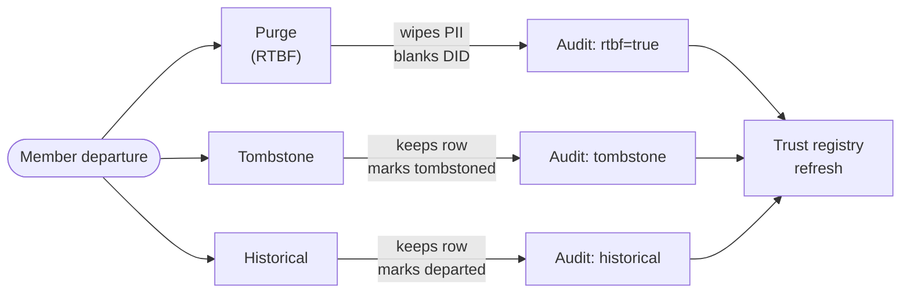
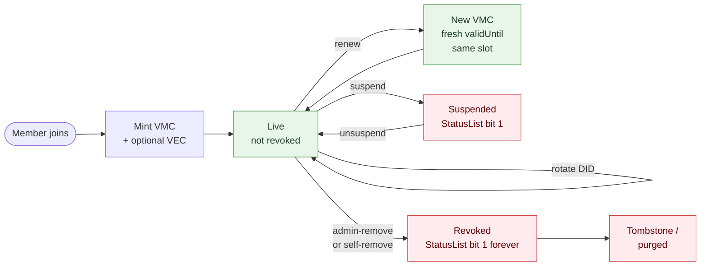
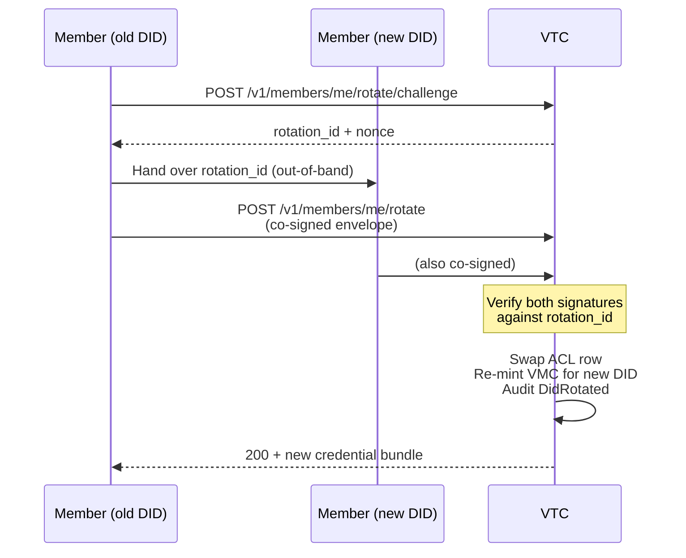

# Community lifecycle

How a member joins, what credentials they receive, how they
maintain membership, and how they leave. The lifecycle is driven
by **Rego policies**: the VTC ships defaults that default-deny, and
operators upload site-specific policies to actually admit anyone.

## Lifecycle states



The VTC tracks every state transition in the audit log
(`AuditEvent::MemberAdded` / `MemberUpdated` / `MemberRemoved` /
`StatusListFlipped` / `MembershipRenewed` / `DidRotated` / …).

## Policies that gate the lifecycle

| Policy | Trigger | Default | Where to author |
|---|---|---|---|
| `join.rego` | `POST /v1/join-requests` | deny-all | `cnm policies upload --purpose join` |
| `removal.rego` | `DELETE /v1/members/{did}` | deny-all | `cnm policies upload --purpose removal` |
| `personhood.rego` | `POST /v1/members/{did}/personhood/assert` | allow if VP carries a `WitnessCredential` (Phase 4 default) | `cnm policies upload --purpose personhood` |
| `relationships.rego` | `POST /v1/relationships` | allow if both parties are current members | `cnm policies upload --purpose relationships` |
| `registry.rego` | `MembershipSyncer` reconciliation | `publish_on_join: true; default_departure: tombstone` | `cnm policies upload --purpose registry` |
| `cross_community_roles.rego` | `POST /v1/auth/recognise` | deny-all (no peer recognition) | `cnm policies upload --purpose cross-community-roles` |

Each policy gets a canonical input shape supplied by the VTC. See
the VTC spec [§8](../05-design-notes/vtc-mvp.md) for the full input
schemas.

## Join flow (happy path)



Both ends use VP/VC envelopes throughout — there is no
bespoke-JSON authorisation format. The credential bundle the member
receives is HPKE-sealed to their `did:key` (the same sealed-transfer
envelope every VTI bootstrap uses).

## Removal dispositions

When a member leaves (self-remove or admin-remove), the operator
chooses one of three dispositions. The choice surfaces in the
trust-registry record so peer communities see the same intent:



- **Purge** — RTBF (right-to-be-forgotten). The member row's PII
  is wiped; the row becomes a tombstone with `purged: true`. The
  trust-registry record is removed (batched per
  `registry.rtbf_batch_window_hours` to break timing correlation).
- **Tombstone** — the member row stays but is marked
  `tombstoned: true`. PII fields stay; further authentication
  fails.
- **Historical** — the member row stays editable for audit /
  historical research. The status-list slot still flips (revoked).

The active `registry.rego` determines which dispositions are
permitted (`removal_options` field) and the default
(`default_departure`). A self-initiated `Purge` always overrides
`min_disposition` (RTBF cannot be downgraded by community policy).

## VMC / VEC lifecycle



- **VMC** = Verifiable Membership Credential. Mandatory for every
  member; `validUntil` is bounded (default 30 days, configurable).
  Inside the community the ACL is authoritative — an expired VMC
  doesn't lock the member out, they just renew via
  `POST /v1/members/me/renew`.
- **VEC** = Verifiable Endorsement Credential. Optional. Adds a
  role or attribute claim (Issuer, Moderator, custom endorsement
  type).
- **VRC** = Verifiable Relationship Credential. Self-issued by
  members to declare trust edges to other members (see
  [`personhood-and-graph.md`](personhood-and-graph.md)).

Each credential has its own slot on the shared BitstringStatusList.
Revocation flips the bit; the public list is served at
`GET /v1/status-lists/{purpose}` so external verifiers can check
without authenticating.

## Renewal failure modes

`POST /v1/members/me/renew` re-evaluates `personhood.rego` against
the member's current evidence. The operator-configured
`renewal.on_personhood_fail` (Phase 4 D5) decides what happens when
the policy returns `false` for a member whose previous
`personhood` flag was `true`:

| Mode | Behaviour |
|---|---|
| `downgrade` (default) | Flip `personhood = false`, re-mint VMC without the flag, audit `PersonhoodRevoked { reason: "renewal-policy" }`, return success. |
| `refuse` | Reject renewal with 403. The member keeps the *old* VMC until they re-present evidence sufficient to pass `personhood.rego`. |

## DID rotation

Members can rotate the DID they authenticate with via a
two-step ceremony:



Both the old and new DID sign the rotation request. The VTC
preserves the member's status-list slot — the same audit identity
moves to the new DID. `did:key` and `did:webvh` are both supported;
for `did:webvh` rotations the VTC resolves the new DID document
and verifies the signing key against it.

## CLI quick reference

```sh
# Member management
cnm members list
cnm members show <did>
cnm members remove <did> --disposition tombstone
cnm join list
cnm join approve <request-id>
cnm join reject <request-id>

# Policy
cnm policies list
cnm policies upload --purpose join --rego ./join.rego
cnm policies activate --id <id>
cnm policies test --id <id> --input ./fixture.json

# Credentials
cnm credentials issue --did <did> --endorsement-type <uri>
cnm credentials revoke --id <credential-id>
```

See [`../04-reference/cli-style.md`](../04-reference/cli-style.md)
for the conventions every CLI verb follows.

## See also

- [Credentials](credentials.md) — VMC / VEC details + status-list
  mechanics.
- [Trust-registry integration](trust-registry.md) — publication
  + cross-community recognition.
- [Personhood + relationships](personhood-and-graph.md) — VRC
  graph + personhood ceremony.
- [VTC MVP spec §5-6](../05-design-notes/vtc-mvp.md) — full
  reference.
