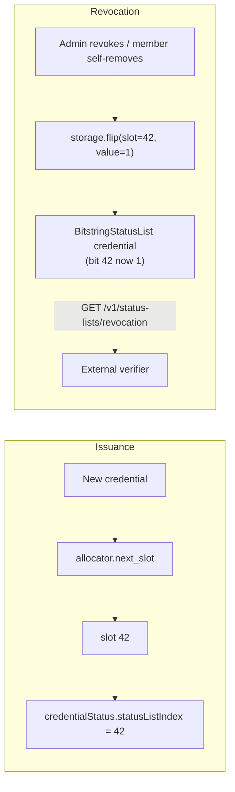
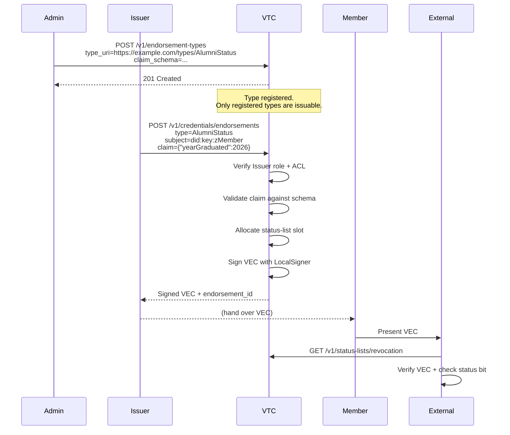

# Credentials

The VTC issues four kinds of W3C Verifiable Credentials, every one
backed by a Bitstring Status List slot for revocation. All use the
`eddsa-jcs-2022` data-integrity proof suite from
`affinidi-data-integrity`.

| Credential | Subject | Issued by | Typical issuance trigger |
|---|---|---|---|
| **VMC** — Verifiable Membership Credential | Member DID | VTC | On join approval, on renewal, on DID rotation |
| **VEC** — Verifiable Endorsement Credential | Member DID | VTC | On role assignment (Moderator, Issuer) or admin-issued endorsement |
| **VRC** — Verifiable Relationship Credential | Other member's DID | Member (self-issued) | `POST /v1/relationships` |
| **Custom endorsement** | Member DID | VTC on behalf of Issuer role | `POST /v1/credentials/endorsements` (Phase 4 M4.7) |

## Credential lifecycle

```mermaid
graph TB
    issue[Issue credential]
    slot[Allocate status-list slot<br/>via slot allocator]
    sign["Sign with LocalSigner<br/>(cached VTA key)"]
    persist[Persist credential row]
    audit_i[Audit: VmcIssued / VecIssued / ...]
    return[Return signed VC<br/>+ status-list reference]

    issue --> slot --> sign --> persist --> audit_i --> return

    use([External verifier reads VC])
    fetch[GET /v1/status-lists/&#123;purpose&#125;]
    check[Check bit at credentialStatus.statusListIndex]

    use --> fetch --> check

    revoke[Revoke credential]
    flip[Flip status-list bit to 1]
    audit_r[Audit: StatusListFlipped<br/>+ CredentialRevoked]
    persist_r[Update credential row]

    revoke --> flip --> audit_r --> persist_r
```



Bit flipping is the source of truth for revocation — the credential
itself stays in the issuer's records, but the verifier sees the
slot as revoked the next time they fetch the public list.

## VMC details

A VMC contains:

```json
{
  "@context": ["https://www.w3.org/ns/credentials/v2", "..."],
  "type": ["VerifiableCredential", "VerifiableMembershipCredential"],
  "issuer": "did:webvh:community.example.com:abc",
  "validFrom": "2026-05-14T...",
  "validUntil": "2026-06-13T...",
  "credentialSubject": {
    "id": "did:key:z6Mk...",
    "membership": {
      "community": "did:webvh:community.example.com:abc",
      "joinedAt": "2026-05-01T...",
      "personhood": true,
      "role": "member"
    }
  },
  "credentialStatus": {
    "id": "https://community.example.com/v1/status-lists/revocation#42",
    "type": "BitstringStatusListEntry",
    "statusPurpose": "revocation",
    "statusListIndex": "42",
    "statusListCredential": "https://community.example.com/v1/status-lists/revocation"
  },
  "proof": { "type": "DataIntegrityProof", "cryptosuite": "eddsa-jcs-2022", "..." }
}
```

`validUntil` is **mandatory + finite**, defaulting to 30 days
(configurable per community). External verifiers MUST see a bounded
VMC. Inside the community the ACL is authoritative — expired VMC
does NOT lock the member out (renewal is unconditional on ACL
membership).

## Status list mechanics



Two status lists exist by default:

- `revocation` — flipped on member removal, credential revocation,
  custom endorsement revocation. Once flipped to `1`, never flips
  back (permanent revocation).
- `suspension` — flipped on admin suspension, can flip back to `0`
  on un-suspend.

Both lists are minted at first boot once `public_url` is configured;
the list URLs are baked into each credential's `credentialStatus`
field so verifiers can locate them.

**Reserved-index discipline** (VTC spec §6.2): slots 0-3 are
reserved as decoys (always flipped to 1 at initial mint) so a
brand-new community doesn't reveal "this is index 0, you're the
first member". The slot allocator skips them.

## Custom endorsements



Custom endorsement issuance is **Issuer-role gated** (or admin).
The Issuer role is granted via a VEC; checking the Issuer role
reads the VTC's ACL directly (the JWT-level role degrades Issuer →
Reader, per the Phase 1 deviation).

Revocation:

```sh
cnm credentials endorsements revoke <endorsement-id>
```

This emits a paired audit:

- `CustomEndorsementRevoked { endorsement_id, endorsement_type }`
- `StatusListFlipped { purpose: "revocation", index: <slot>, revoked: true }`

## Renewal vs DID rotation

| | Renewal | DID rotation |
|---|---|---|
| Triggered by | `POST /v1/members/me/renew` | `POST /v1/members/me/rotate/challenge` + `…/rotate` |
| What changes | `validUntil` extended + (optionally) `personhood` re-evaluated | Member's authenticating DID swapped |
| Old credential | Superseded but bit stays 0 until separately revoked | Same — replaced by the new-DID VMC |
| Status-list slot | Preserved | Preserved |
| Audit | `MembershipRenewed` (+ `PersonhoodRevoked { reason: "renewal-policy" }` on downgrade) | `DidRotated { from, to, method }` |

Both operations preserve the member's audit identity — the
slot doesn't change, so an external verifier who pinned the
`credentialStatus.statusListIndex` sees continuous, uninterrupted
membership across renewals and rotations.

## CLI quick reference

```sh
# Endorsement types
cnm endorsement-types list
cnm endorsement-types create --type-uri 'https://example.com/types/AlumniStatus' \
    --schema '{ "type": "object", "properties": {...} }'
cnm endorsement-types delete --type-uri '...'

# Endorsements
cnm credentials endorsements issue \
    --subject did:key:z6Mk... \
    --type 'https://example.com/types/AlumniStatus' \
    --claim '{"yearGraduated":2026}'
cnm credentials endorsements list --subject did:key:z6Mk...
cnm credentials endorsements revoke <id>

# Renewal + rotation (member-side, via pnm)
pnm vtc renew
pnm vtc rotate --to did:key:z6MkNew...
```

## See also

- [Community lifecycle](community-lifecycle.md) — when credentials
  get issued in the broader join → renew → leave flow.
- [Personhood + relationships](personhood-and-graph.md) — the VRC
  graph + personhood ceremony.
- [VTC MVP spec §6](../05-design-notes/vtc-mvp.md) — full
  credentials reference.
