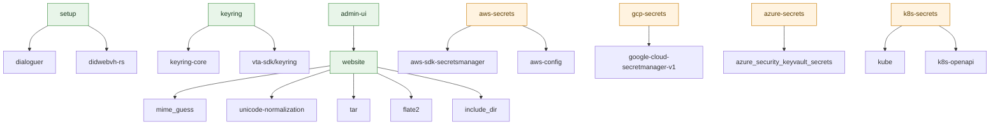

# VTC feature flags

Cargo feature reference for the `vtc-service` crate. Mirror of
[`02-vta/feature-flags.md`](../02-vta/feature-flags.md) for the VTA
side.

## Quick reference

| Feature | Default | Purpose | Pulls in |
|---|---|---|---|
| `setup` | ✓ | Interactive setup wizard + `did:webvh` template plumbing | `dialoguer`, `didwebvh-rs`, `url` |
| `keyring` | ✓ | OS keyring secret backend | `keyring-core`, `vta-sdk/keyring` |
| `website` | ✓ | Public community website handler + default landing page + bundle deploy | `mime_guess`, `unicode-normalization`, `tar`, `flate2`, `include_dir` |
| `admin-ui` | ✓ | Embedded admin SPA (requires `website` for `include_dir`) | `website` |
| `config-secret` | – | Store the master secret inline in `config.toml` (dev only) | – |
| `aws-secrets` | – | AWS Secrets Manager secret backend | `aws-sdk-secretsmanager`, `aws-config` |
| `gcp-secrets` | – | GCP Secret Manager secret backend | `google-cloud-secretmanager-v1`, `google-cloud-auth`, `bytes` |
| `azure-secrets` | – | Azure Key Vault secret backend | `azure_security_keyvault_secrets`, `azure_identity` |
| `k8s-secrets` | – | Kubernetes `Secret` secret backend (in-cluster SA or kubeconfig) | `kube`, `k8s-openapi` |

## Deployment profiles

### Standard self-hosted

`cargo build --release --package vtc-service`

Default features. Operator manages a local OS-keyring-backed master
secret. Public website + admin UX are baked in.

### API-only (no public website)

`cargo build --release --package vtc-service --no-default-features --features setup,keyring`

Removes the public website surface (404 on `/`) and the admin UX
(404 on `/admin/*`). Useful when the community fronts its public
identity through a separate static host + CDN and only exposes
`/v1/*` from the VTC.

### Cloud-secret-managed

`cargo build --release --package vtc-service --features aws-secrets`
(or `gcp-secrets` / `azure-secrets`)

Use a cloud secret manager instead of the OS keyring. See the
[VTA secret backends doc](../02-vta/secret-backends.md) for the
backend selection logic — it applies identically to the VTC.

### In-cluster Kubernetes `Secret`

`cargo build --release --package vtc-service --features k8s-secrets`

Store the VTC key bundle in a native Kubernetes `Secret` instead of
a cloud secret manager — no extra infrastructure beyond a `Secret` +
RBAC. Configured via the `[secrets]` `k8s_secret_name` /
`k8s_namespace` / `k8s_secret_key` keys (or the matching
`VTC_SECRETS_K8S_*` env vars). The mechanics mirror the VTA's
Kubernetes backend — see the
[VTA secret backends doc](../02-vta/secret-backends.md#kubernetes-secret)
(substitute `VTC_` for `VTA_` env-var prefixes and `secret` for the
default data key).

## Dependency graph

Default-on features are green; opt-in features are amber.

## Feature interactions

- `admin-ui` requires `website` — the `include_dir` dep is pulled
  via `website`, and the admin sub-router lives in the same
  middleware stack as the public website.
- `setup` is required for the `vtc setup` wizard; without it, the
  daemon expects a pre-populated config + secret store on first
  boot.
- Exactly **one** secret backend should be enabled at a time. The
  workspace picks the first one in priority order:
  `keyring` > `aws-secrets` > `gcp-secrets` > `azure-secrets` >
  `config-secret`. When in doubt, build with explicit `--no-default-features
  --features <one-backend>,setup`.

## See also

- [VTA feature flags](../02-vta/feature-flags.md) — full backend
  selection logic.
- [VTA secret backends](../02-vta/secret-backends.md) — runtime
  config for cloud secret managers.
