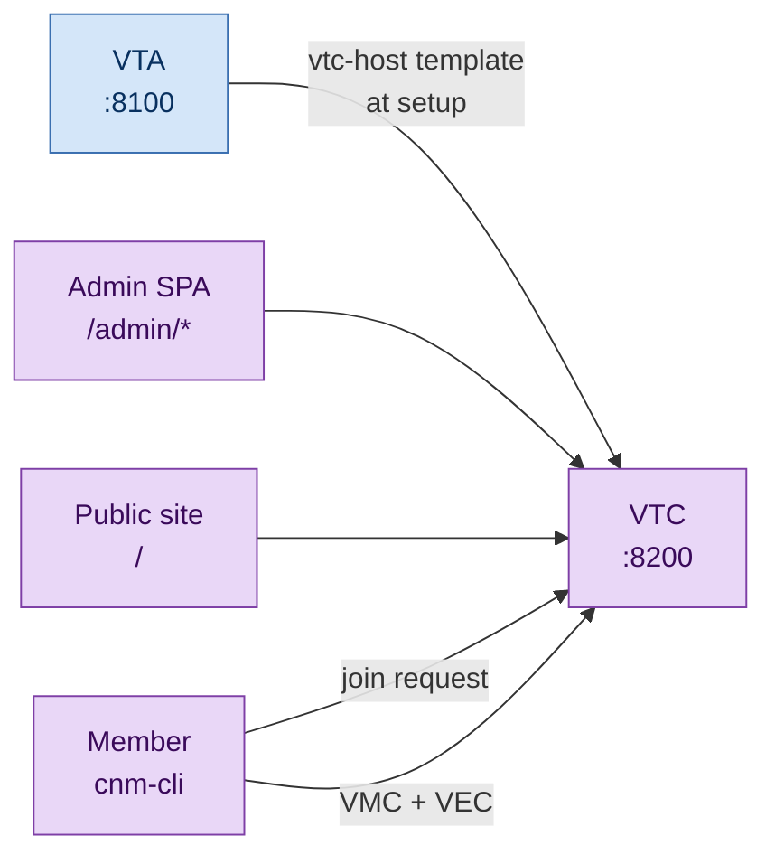
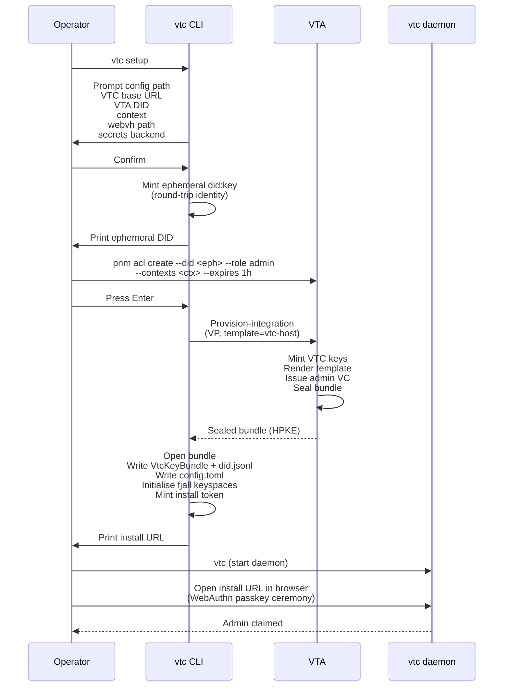

# Getting started with a VTC

A working VTC in 10 minutes, assuming you already have an
**already-running VTA**. If you don't, run through
[`02-vta/cold-start.md`](../02-vta/cold-start.md) first — a VTC
cannot exist without a VTA to mint its identity.

## What you'll end up with



A running `vtc` binary on port 8200 with:

- A `vtc_did` minted by your VTA's `vtc-host` template.
- A `config.toml` written by the setup wizard.
- A populated fjall store at `<data_dir>/`.
- An admin DID with a bearer JWT credential (kept in the OS keyring
  by default).
- A default landing page at `GET /` and the admin SPA at
  `/admin/*`.

## Prerequisites

- A running VTA reachable over HTTPS (`https://vta.example.com`).
- An ephemeral admin DID authorised on the VTA for the context that
  will host this VTC. The PNM CLI prints one during the VTC setup
  wizard; you'll paste it into `pnm acl create --did ... --role
  admin --contexts <ctx> --expires 1h`.
- Rust 1.94.0+ + `cargo` on your local box.
- OS keyring support (default — see the alternatives in the
  [secret backends doc](../02-vta/secret-backends.md), which apply
  equally to the VTC).

## Setup flow



## Step 1 — Run the setup wizard

```sh
cargo run --package vtc-service -- setup
```

The wizard prompts:

| # | Prompt | Notes |
|---|---|---|
| 1 | Config path | Default `config.toml` |
| 2 | VTC base URL | The URL the daemon will publish (e.g. `https://community.example.com`) |
| 3 | VTA DID | The VTA's `did:webvh:...` identifier. Transport endpoints are resolved from the DID document — no separate VTA URL prompt |
| 4 | Context name | The context inside the VTA that will own this VTC (created via `cnm contexts create` if it doesn't already exist) |
| 5 | WebVH path | Optional. Blank lets the WebVH server auto-assign |
| 6 | Secrets backend | `keyring` (default) / `aws` / `gcp` / `azure` / `inline` / `plaintext` |

The wizard prints an ephemeral `did:key` and pauses. **Authorise it
on the VTA** (this is the operator's choice — it's how you prove
to the VTA that you control this VTC provisioning attempt):

```sh
# On a workstation that has admin access to the VTA:
pnm acl create \
    --did "did:key:z6Mk..." \
    --role admin \
    --contexts mycommunity \
    --expires 1h
```

Press Enter in the VTC setup wizard. It drives the
provision-integration round trip against the VTA, opens the sealed
bundle, and writes:

- `<data_dir>/did/<scid>.jsonl` — the `did:webvh` log entry the
  daemon serves at `GET /v1/{scid}/did.jsonl`.
- `config.toml` — the VTC's runtime configuration.
- The `VtcKeyBundle` to the configured secrets backend.

The wizard prints a one-shot **install URL**. Save it.

## Step 2 — Start the daemon

```sh
cargo run --package vtc-service
```

The daemon listens on `0.0.0.0:8200` by default (override via
`VTC_SERVER_HOST` / `VTC_SERVER_PORT`). Verify:

```sh
curl http://localhost:8200/health
```

`200 OK` with a small JSON body.

## Step 3 — Claim the admin passkey

Open the install URL from step 1 in a browser. The page is the
embedded admin SPA serving the install flow:

1. You type the **claim code** the wizard printed alongside the URL.
   URL + code travel through separate channels — a leaked URL alone
   doesn't grant admin.
2. The browser registers a passkey via WebAuthn (any algorithm the
   authenticator supports — ES256, RS256, EdDSA all work).
3. The SPA submits `POST /v1/install/claim/start` and `…/finish`.
4. The token row transitions `Issued` → `Consumed` and can never be
   redeemed again.
5. The page prints the admin DID + a one-time admin credential
   bundle.

Import the bundle into the CNM CLI:

```sh
cnm auth login <paste-bundle-here>
```

The CLI imports the credential into the OS keyring, runs the
challenge-response handshake, caches the JWT, and confirms the
identity. Subsequent commands authenticate automatically:

```sh
cnm health
cnm community profile show
```

## Step 4 — Configure policy (optional)

Out of the box, the VTC ships default Rego policies that admit
nothing (`join.rego` and `removal.rego` default-deny) so a fresh
community has zero implicit members. Upload your own policies via:

```sh
# Upload a custom join policy
cnm policies upload --purpose join --rego ./my-join.rego

# Activate it
cnm policies activate --id <returned-policy-id>
```

See [`community-lifecycle.md`](community-lifecycle.md) for the
canonical Rego inputs each policy receives and worked examples.

## Step 5 — Receive your first join request

A prospective member presents a Verifiable Presentation containing
the evidence credentials your policy demands, then POSTs the VP to
`/v1/join-requests`:

```sh
# Member-side, with their own DID + signing key
curl https://community.example.com/v1/join-requests \
  -H 'Content-Type: application/json' \
  -H 'Trust-Task: https://trusttasks.org/openvtc/vtc/join-requests/submit/1.0' \
  --data @join-request.json
```

The VTC evaluates the active `join.rego` against the presented
evidence. On `allow`, it persists the request and notifies admins;
on `deny`, it returns 403 with the rule failure reason.

Admins approve via:

```sh
cnm join approve <request-id>
```

The VTC issues a VMC + (optionally) VECs, allocates a status-list
slot for revocation, and returns the credential bundle to the
member.

## Step 6 — Configure a public website (optional)

By default the VTC serves a small in-tree landing page at `GET /`.
To replace it with your community's site:

```toml
# config.toml
[website]
root_dir = "/var/lib/community/site"
deploy_mode = "live"          # or "managed" for generation-based deploys
```

Drop files into `/var/lib/community/site/` directly (`scp`, `rsync`,
`git pull`) or upload a bundle via `POST /v1/website/deploy`. See
[`website-and-admin.md`](website-and-admin.md) for the
full surface.

## Where to go next

| If you want to… | Read |
|---|---|
| Understand the module layout | [`architecture.md`](architecture.md) |
| Author policies + manage members | [`community-lifecycle.md`](community-lifecycle.md) |
| Issue credentials + revoke them | [`credentials.md`](credentials.md) |
| Publish to a trust registry | [`trust-registry.md`](trust-registry.md) |
| Assert personhood + manage the VRC graph | [`personhood-and-graph.md`](personhood-and-graph.md) |
| Host a public website + admin UX | [`website-and-admin.md`](website-and-admin.md) |
| See the full VTC spec | [`../05-design-notes/vtc-mvp.md`](../05-design-notes/vtc-mvp.md) |
