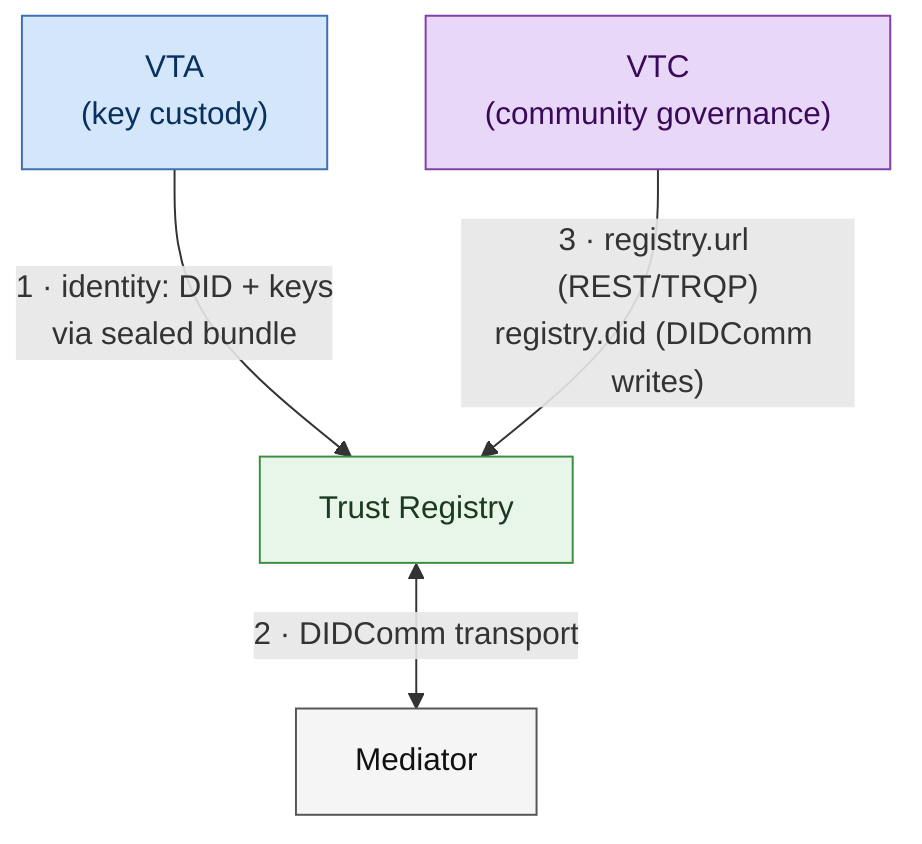

# Trust-registry deployment runbook

A step-by-step guide to standing up an
`affinidi-trust-registry-rs` instance, giving it an identity from a
VTA, and wiring a VTC to it.

Where [trust-registry integration](trust-registry.md) explains
*what* the VTC publishes and *why*, this document is the
operational sequence: which command to run, in which order, and
what to check before moving on.

## The three wirings

Deploying a registry into a VTI stack means establishing three
independent relationships. They are often conflated, and they fail
in different ways.



The VTA relationship is **not** peering. The registry does not
register itself with a VTA the way a VTC does. In VTA mode the
registry simply holds no private keys: at startup it authenticates
to the VTA, pulls its DID + keys for a named context, and uses
those to reach the mediator. Identity custody, nothing more.

## Order of operations

| Stage | Establishes | Gate |
|---|---|---|
| 1 | Registry runs standalone, TRQP answers | `curl /health`, `POST /recognition` |
| 2 | Real DID, mediator connection | `/.well-known/did.json` resolves |
| 3 | Trust Tasks round-trip | `test-trust-registry` mediator tests |
| 4 | Identity sourced from the VTA | stages 1–3 pass again, new identity |
| 5 | VTC points at the registry | VTC `registry_status` |

Do not start at stage 4. The registry's `vta` feature has no
end-to-end test coverage — three unit tests over `string://`
fixtures, no VTA server ever contacted — and it is excluded from
the published Docker image. Prove the mediator path first so a
stage-4 failure has exactly one candidate cause.

---

## Stage 0 — Values you will need

| Value | Source | Example |
|---|---|---|
| Mediator DID | mediator deployment | `did:webvh:Qm…:webvh.example:mediator` |
| VTA URL | VTA deployment | `https://vta.example.com` |
| WebVH host | DID-hosting server | `https://webvh.example.com` |
| Admin DID(s) | operators permitted to write records | `did:peer:2.Vz6Mk…` |
| VTC DID | VTC `config.toml` | `did:webvh:Qm…:webvh.example:vtc` |

The mediator's transport URL is never configured — it is resolved
from the mediator's DID document. Confirm that resolves before
anything else:

```bash
curl -s https://webvh.example/mediator/did.json | jq .
```

---

## Stage 1 — Registry standalone

Proves the binary, storage layer, and HTTP surface with no DIDComm
involved.

```bash
cd affinidi-trust-registry-rs
cp .env.example .env
```

Reduce `.env` to:

```dotenv
TR_STORAGE_BACKEND=csv
FILE_STORAGE_PATH=./sample-data/data.csv
LISTEN_ADDRESS=127.0.0.1:3232
CORS_ALLOWED_ORIGINS=*
AUDIT_LOG_FORMAT=json
```

Setting `ENABLE_DIDCOMM=false` short-circuits before any mediator
or profile variable is read:

```bash
ENABLE_DIDCOMM=false RUST_LOG=info cargo run --bin trust-registry
```

The registry exposes five routes: `/health`, `/recognition`,
`/authorization`, `/trust-tasks`, and `/.well-known/did.json`.
TRQP request bodies are the flattened 4-tuple plus an optional
`context` object:

```bash
curl -s localhost:3232/health          # -> {"status":"OK"}

curl -s -X POST localhost:3232/recognition \
  -H 'content-type: application/json' \
  -d '{"entity_id":"did:example:entity3",
       "authority_id":"did:example:authority3",
       "action":"action3",
       "resource":"resource3"}' | jq .
```

Those identifiers are the `recognition`-type row in
`sample-data/data.csv`; the `entity1/authority1/action1/resource1`
row is the `authorization` one.

**Gate:** both calls return 200 with a record.

---

## Stage 2 — Real DID and mediator

Use the provisioning CLI rather than hand-authoring
`PROFILE_CONFIG`:

```bash
cargo run --bin setup-trust-registry --features dev-tools -- \
  --mediator-did "did:webvh:Qm…:webvh.example:mediator" \
  --did-method webvh \
  --didweb-url https://webvh.example.com \
  --admin-dids "did:peer:2.Vz6Mk…" \
  --storage-backend csv \
  --file-storage-path ./sample-data/data.csv \
  --acl-mode ExplicitDeny \
  --audit-log-format json \
  --non-interactive
```

Points worth knowing:

- `--non-interactive` skips a raw-mode "press any key once the DID
  document is hosted" pause. Without it a non-TTY run hangs.
- `--did-method webvh` writes `did.json` and `did.jsonl` locally.
  **You must host them at `--didweb-url` yourself** — with
  `--non-interactive` nothing waits for you to do so.
- Prefer `webvh` over `peer` if VTA key rotation is ever wanted;
  rotation requires a `did:webvh`.
- The tool rewrites `.env` and `.env.test`, and sets the mediator
  ACL to `ExplicitDeny` for the new DID.
- Export `TR_ADVERTISE_TSP=true` beforehand to add a
  `TSPTransport` service entry to the generated DID document.

```bash
RUST_LOG=info cargo run --bin trust-registry
curl -s localhost:3232/.well-known/did.json | jq .
```

**Gate:** the DID document serves locally, resolves at the WebVH
URL, and the logs show the mediator profile added with live
streaming enabled.

### Choosing an ACL mode

`ExplicitDeny` is public — anyone may connect, listed DIDs are
blocked. `ExplicitAllow` is private — only listed DIDs may
connect. Only the exact literal `ExplicitAllow` selects private
mode; **any typo falls back silently to `ExplicitDeny`**. If you
intended a private registry, verify rather than assume.

---

## Stage 3 — Trust Tasks round-trip

```bash
cargo test -p test-trust-registry --features mediator \
  --test mediator -- --ignored
```

The routed tests are `#[ignore]`d by default. Add `--features tsp`
for the TSP-multiplexed variant. This uses an in-process test
mediator, so it exercises the code path without your real one.

**Gate:** green. A failure here is in the registry, not your
configuration.

---

## Stage 4 — Move identity to the VTA

Two roles, which may be the same person. Provisioning is done with
the `pnm` CLI; see
[provision-integration](../02-vta/provision-integration.md) for the
general sealed-transfer pattern.

### Build with the feature

```bash
cargo build --release --bin trust-registry --features vta
```

`vta` is in neither the default build nor the Docker image — the
shipped `docker-compose.yaml` cannot run VTA mode. Containerised
deployments need a custom image. Append a secrets backend, e.g.
`--features "vta,secrets-aws"`, to keep the offline cache off
local disk.

### Registry operator — recipient request

Run **on the machine that will run the registry**; it writes a
secret to `~/.config/pnm/bootstrap-secrets/` that exists nowhere
else.

```bash
export VTA_URL=https://vta.example.com
pnm health

pnm bootstrap request \
  --out tr-request.json \
  --label "trust-registry"
```

`tr-request.json` holds only a public key and nonce. Send it to
the VTA operator out of band; keep the local secret.

### VTA operator — provision the context

```bash
pnm contexts provision \
  --id trust-registry \
  --name "Trust Registry" \
  --server https://webvh.example.com \
  --mediator-service \
  --recipient tr-request.json
```

- `--id trust-registry` becomes `TR_VTA_CONTEXT_ID`.
- `--mediator-service` is **required here** — it adds the mediator
  service endpoint the registry needs to connect over DIDComm.
- `--server` creates the registry's `did:webvh` on that host; use
  `--did-url` when self-hosting.
- `--pre-rotation <N>` pre-generates rotation keys. Decide now;
  retrofitting is harder.

The command emits an armored sealed bundle and a SHA-256 digest.
Send the bundle as a file and the digest over a *different*
channel.

### Registry operator — open the bundle

```bash
pnm bootstrap open \
  --bundle tr-sealed.txt \
  --expect-digest <sha256-hex>
```

The digest check is mandatory; there is no trust-on-first-use.
`--no-verify-digest` exists for testing only.

The recovered bundle:

```json
{
  "did": "did:key:z6Mk...",
  "privateKeyMultibase": "z...",
  "vtaDid": "did:webvh:...:vta.example.com:...",
  "vtaUrl": "https://vta.example.com"
}
```

Install it with restrictive permissions:

```bash
sudo install -m 600 -D /dev/stdin \
  /etc/trust-registry/vta-credential.json < bundle.json
```

### Configure the registry

Start from `.env.vta.example`. Minimum viable:

```dotenv
ENABLE_DIDCOMM=true
MEDIATOR_DID=did:webvh:Qm…:webvh.example:mediator
TR_VTA_CREDENTIAL=file:///etc/trust-registry/vta-credential.json
TR_VTA_CONTEXT_ID=trust-registry
LISTEN_ADDRESS=0.0.0.0:3232
ACL_MODE=ExplicitDeny
AUDIT_LOG_FORMAT=json
RUST_LOG=info
```

Four traps, all silent:

1. **Remove `PROFILE_CONFIG`.** VTA takes precedence and it is
   never read; a stale value only misleads later readers.
2. `ENABLE_DIDCOMM` must be exactly `true`. Any other value skips
   the VTA entirely and boots with empty DIDComm config — which
   looks healthy.
3. `TR_VTA_CONTEXT_ID` is mandatory whenever `TR_VTA_CREDENTIAL`
   is set; omitting it is a hard startup error.
4. `TR_VTA_CREDENTIAL` goes through a URI loader in which an
   **unrecognised scheme is treated as a literal string**. A typo
   such as `fille://…` does not error — it tries to parse the path
   itself as JSON.

Valid schemes: `file://`, `aws_secrets://`,
`aws_parameter_store://`, `string://`.

### Offline cache

If the VTA is unreachable at boot the registry falls back to the
last cached bundle. **If the VTA is down and the cache is empty,
startup fails — there is no fallback to `PROFILE_CONFIG`.**

The default cache is the local directory `./.trust-registry`. For
AWS (requires `--features "vta,secrets-aws"`):

```dotenv
TR_SECRETS_AWS_SECRET_NAME=trust-registry/vta-cache
TR_SECRETS_AWS_REGION=ap-southeast-1
```

Boot once while the VTA is up to populate the cache *before*
depending on it.

### Verify

```bash
RUST_LOG=info ./target/release/trust-registry

curl -s localhost:3232/health
curl -s localhost:3232/.well-known/did.json | jq .
```

The logs should show the bundle fetched from the VTA, then
mediator authentication. The VTA bundle *is* the mediator
credential — there is no separate mediator-key step.

**Gate:** stages 1 and 3 pass again under the new identity.

---

## Stage 5 — Point the VTC at the registry

In the VTC's `config.toml`:

```toml
[registry]
url = "https://trust-registry.example.org"
health_probe_interval_seconds = 60
http_timeout_seconds = 5
rtbf_batch_window_hours = 24
```

Deliberately omit `did` for now — see the caveat below.

- `url` unset → registry features no-op and `registry_status`
  reads `degraded`.
- `did` unset → membership hooks are not spawned.
- `degraded_threshold_seconds` appears in
  [trust-registry.md](trust-registry.md) but not in
  `RegistryConfig`. Setting it has no effect.

The health probe is a `GET /.well-known/did.json` against `url`,
so a passing stage 4 means the VTC will report the registry
healthy.

---

## Known defects on this seam

Tracked as **D6** in the networking remediation plan. Both change
how you should read symptoms.

**DIDComm writes are not yet functional.**
`UpstreamRegistryClient::publish_member` and `delete_member`
return `RegistryError::Permanent` unconditionally — the DIDComm
transport is still pending, and `with_atm` is never called. Every
membership sync fails. Because `health()` only issues a `GET
/.well-known/did.json`, **`registry_status` stays green while
nothing syncs.** This is why stage 5 leaves `registry.did` unset:
setting it today buys failing hooks and a misleading indicator.

**The `recognized` field is a two-sided optionality mismatch.**
The registry serialises `recognized` with
`skip_serializing_if = Option::is_none`; the VTC's
`RecognitionResponse` requires it. A 200 response omitting the
field fails to parse, is misclassified as transient, and surfaces
as `RegistryUnreachable` — so cross-community session mint returns
**503 indefinitely instead of a clean 403**. Persistent 503s on
cross-community mint are this, not a network fault. Absence must
be treated restrictively rather than as transport failure.

---

## Troubleshooting

| Symptom | Likely cause |
|---|---|
| Boots cleanly, no mediator activity | `ENABLE_DIDCOMM` not exactly `true` |
| Startup fails when VTA unreachable | empty offline cache; no `PROFILE_CONFIG` fallback |
| Parse error on a valid credential file | mistyped URI scheme → treated as a literal |
| Private ACL not enforced | `ACL_MODE` typo → silent `ExplicitDeny` |
| Peers cannot reach the registry | `did:webvh` generated but never hosted |
| VTC green, membership never syncs | DIDComm write defect above |
| Cross-community mint 503s forever | `recognized` mismatch above |
| Docker image ignores VTA settings | `vta` not compiled into the shipped image |
| Keys still in plaintext `.env` | setup tool writes both, cloud backend or not |

## Configuration notes

- The registry has **no config file** — environment variables
  only, loaded from `.env` via `dotenvy`. The TOML in stage 5 is
  the VTC's, not the registry's.
- Identity precedence is **VTA → secret store → `PROFILE_CONFIG`**.
- Backend selection deliberately excludes the OS keyring, so a
  keyring-only configuration silently continues using
  `PROFILE_CONFIG`.

## See also

- [Trust-registry integration](trust-registry.md) — what the VTC
  publishes, membership sync, cross-community recognition.
- [Provision-integration](../02-vta/provision-integration.md) —
  the general DID-template and sealed-transfer flow.
- [VTA secret backends](../02-vta/secret-backends.md) — backend
  choices that also apply to the registry's offline cache.
