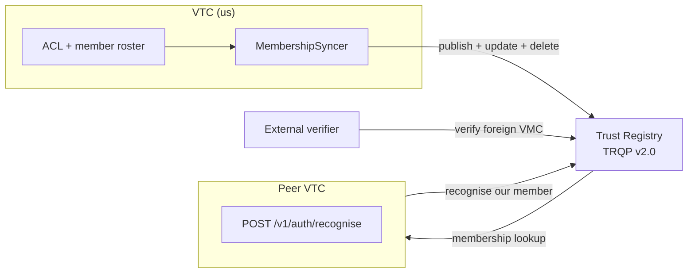
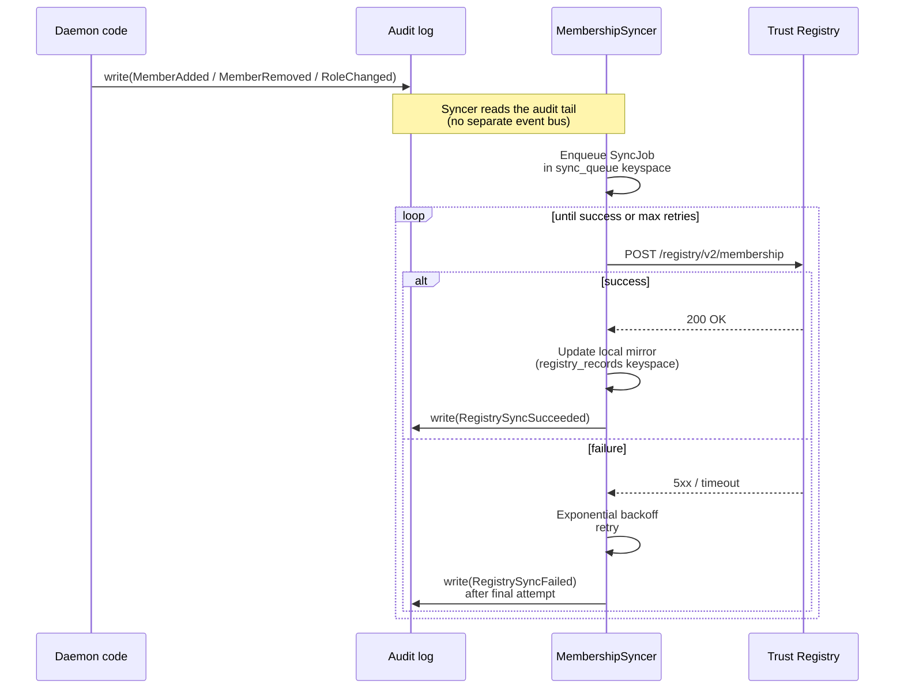
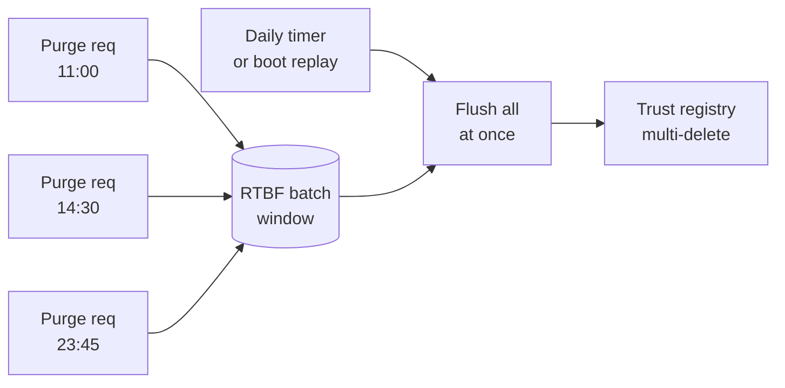

# Trust-registry integration

How the VTC publishes its membership to an external trust registry,
how the `MembershipSyncer` keeps the published view in step with
the local ACL, and how cross-community recognition lets one VTC
mint a session for a member of a peer community.

## Why a trust registry?

A trust registry answers the question **"is `did:key:zFoo...` an
active member of community X right now?"** for verifiers who don't
have direct access to the community's ACL. The VTC writes to it;
external verifiers read from it.



The VTC uses **TRQP v2.0** (Trust Registry Query Protocol) via the
`affinidi-trust-registry-rs` client (or any TRQP-compatible
backend).

## Publication



The syncer:

- Subscribes to audit-tail events (`MemberAdded` / `MemberRemoved`
  / `RoleChanged`) — the audit log is the source of truth for
  triggers, not a separate event bus.
- Persists each pending job in a `sync_queue` fjall keyspace so
  pending work survives restarts. At boot, the syncer replays
  outstanding jobs.
- Uses exponential backoff on failure (default starts at 30s,
  doubles, caps at 1h).
- Surfaces health on `GET /v1/health/diagnostics`:
  - `registry_status: "active" | "degraded"`
  - `sync_queue_depth: <u32>`
  - `last_sync_at: <iso8601>`
  - `last_failure_reason: <string>`

`registry_status` flips to `degraded` when the queue is ≥1h behind
(configurable via `registry.degraded_threshold_seconds`).

## RTBF batching

A self-initiated `Purge` (right-to-be-forgotten) is timing-sensitive:
if a single member purges and the registry record disappears within
seconds, a malicious observer can correlate the audit event with the
specific member.

The VTC defends with **batched RTBF deletes**:



`registry.rtbf_batch_window_hours` (default 24) coalesces every
RTBF deletion into one daily batch. The batch trigger fires on a
periodic timer AND at boot (so a daemon restart doesn't leak
batched purges that haven't yet flushed).

## Cross-community recognition

A peer community's member asks our VTC for a session by **presenting**
their `(VEC, VMC)` pair inside a holder-signed Verifiable Presentation.
A VEC + VMC are bearer artifacts: anyone who captures the pair (a relayed
join, an audit log, a compromised member device) would otherwise hold a
replayable impersonation token for that subject. So recognition is a
**two-step, proof-of-possession-bound** flow (P0.2, PRs #351 + #354) —
the caller first fetches a single-use challenge, then presents the
credentials inside a VP whose holder proof commits to that challenge.
Our VTC verifies the holder + issuer proofs, checks the peer registry,
runs `cross_community_roles.rego` to map their role to ours, and (on
success) mints a session.

```mermaid
sequenceDiagram
    participant M as Foreign member
    participant US as Our VTC
    participant FOREIGN as Their VTC
    participant TR as Trust Registry

    M->>US: POST /v1/auth/recognise/challenge
    US-->>M: { nonce, expires_at }<br/>(single-use, TTL'd, bound to our DID)
    M->>US: POST /v1/auth/recognise<br/>(VP: holder proof over nonce + our DID;<br/>embeds VEC + VMC)
    US->>US: Consume nonce (single-use)
    US->>US: Verify holder proof + each embedded issuer proof
    US->>US: Require VP holder == VEC subject == VMC subject
    alt holder proof / subject mismatch
        US-->>M: 401 / 403
    else proofs valid
        US->>FOREIGN: GET /v1/status-lists/revocation
        FOREIGN-->>US: Status list
        US->>US: Check bit at credentialStatus.statusListIndex
        alt slot revoked
            US-->>M: 403 ForeignCredentialRevoked
        else slot clear
            US->>TR: GET /registry/v2/membership/<foreign-issuer>
            TR-->>US: Active / not-active
            alt foreign issuer not in registry
                US-->>M: 403 IssuerNotRecognised
            else recognised
                US->>US: Evaluate cross_community_roles.rego
                US->>US: Mint session<br/>TTL = min(JWT-default, VEC.validUntil, VMC.validUntil)
                US-->>M: { access_token, refresh_token }
            end
        end
    end
```

**Session-mint hardening invariants** (every one is load-bearing):

- **Holder proof-of-possession.** The VP's `eddsa-jcs-2022` holder proof
  (`proofPurpose: authentication`) must verify and commit to the
  single-use challenge `nonce` (freshness/replay) plus this VTC's DID as
  `domain` (audience). A captured VEC + VMC is inert without the
  subject's private key, and a replayed VP finds its nonce already
  consumed.
- **Subject binding.** The verified VP holder DID must equal the VEC
  `credentialSubject.id`, and the VMC subject must equal the VEC subject.
  The VMC only attests "live, non-revoked member"; without the
  `vmc.subject == vec.subject` check, member A's role VEC paired with any
  *other* current member B's VMC (same issuer) would pass the gate.
- Foreign VEC + VMC must pass a **live** status-list revocation check.
- Foreign issuer must be in the trust-registry recognition graph
  **at mint time**.
- Minted session TTL = `min(JWT-audience-default,
  foreign-VEC.validUntil, foreign-VMC.validUntil)`.
- **No caching, no refresh** — every mint re-runs holder/issuer proof +
  policy + status-list + registry checks. Cross-community sessions
  (`xc-`-prefixed) never refresh; a peer community removed mid-session
  loses access when the clamped TTL elapses.
- **Untrusted denied-path audit actor.** On a rejected recognise the
  audit envelope's actor is the cryptographically-proven VP holder (the
  signer), never an unverified DID lifted from the credential body.

## Configuration

```toml
# config.toml
[registry]
url = "https://trust-registry.example.org"
http_timeout_seconds = 30
health_probe_interval_seconds = 300       # 5 minutes; 0 disables
rtbf_batch_window_hours = 24              # daily flush
degraded_threshold_seconds = 3600         # status flips to degraded after 1h lag
```

Setting `registry.url = ""` (or omitting it) disables registry
features entirely — the daemon runs in "no-registry" mode,
`registry_status` reports `degraded`, and `cross_community_roles`
short-circuits to deny-all.

## CLI quick reference

```sh
# Registry health
cnm registry health
cnm registry profile show     # community's registry record

# Sync queue inspection
cnm registry queue list
cnm registry queue retry --id <job-id>
cnm registry queue cancel --id <job-id>

# Force a re-publish
cnm registry refresh
```

## See also

- [Trust-registry deployment](trust-registry-deployment.md) — the
  operational runbook: standing up a registry, sourcing its
  identity from a VTA, wiring this `[registry]` block.
- [VTC MVP spec §8](../05-design-notes/vtc-mvp.md) — full TRQP
  binding + reconciliation details.
- [Community lifecycle](community-lifecycle.md) — what events
  trigger registry sync (`MemberAdded`, etc.).
- [Credentials](credentials.md) — status-list mechanics that
  recognition relies on.
