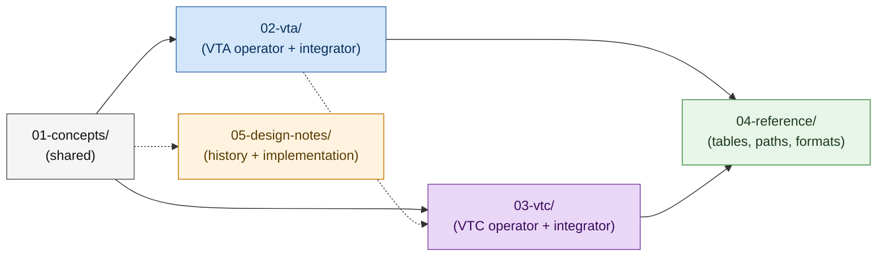

# Verifiable Trust Infrastructure — Documentation

A guided tour of the workspace: what the VTA and VTC are, how to
operate each one, how to integrate with them, and where the design
decisions live.

## How this tree is organised

The dotted line from `02-vta/` to `03-vtc/` reflects the runtime
relationship: a VTC is always provisioned **on top of** an existing
VTA via the `vtc-host` DID template.

## If you're trying to…

| Task | Start here |
|---|---|
| Understand VTI as a whole | [Overview](01-concepts/overview.md) |
| Decide between VTA and VTC | [Root README — Which service do you need?](../README.md#which-service-do-you-need) |
| Stand up a VTA from scratch | [VTA cold-start](02-vta/cold-start.md) |
| Stand up a VTC on an existing VTA | [VTC getting started](03-vtc/getting-started.md) |
| Pick where to store the master seed | [VTA secret backends](02-vta/secret-backends.md) |
| Deploy a VTA inside a Nitro Enclave | [TEE architecture](02-vta/tee-architecture.md) |
| Build an app that uses a VTA | [VTA integration guide](02-vta/integration-guide.md) |
| Provision a mediator / webvh-host / custom integration | [Provision-integration](02-vta/provision-integration.md) |
| Configure community membership policy | [VTC community lifecycle](03-vtc/community-lifecycle.md) |
| Host a public community website | [VTC website + admin UX](03-vtc/website-and-admin.md) |
| Look up a BIP-32 path | [BIP-32 paths](04-reference/bip32-paths.md) |
| Read the threat model | [Security model](01-concepts/security-model.md) |

## Table of contents

### Part I — Concepts (shared)

Both VTA and VTC build on the same foundation. Read this first.

- **[Overview](01-concepts/overview.md)** — what VTI is, what VTA
  and VTC each do, how they relate, the technology stack, request
  flow.
- **[Architecture](01-concepts/architecture.md)** — workspace
  layout, crate map, shared module structure, API surface, how to
  add a new front-end binary.
- **[Security model](01-concepts/security-model.md)** —
  defense-in-depth, key lifecycle, threat model, attack trees,
  cryptographic inventory, deployment checklist.

### Part II — VTA

How to operate, deploy, and integrate against a VTA.

- **[Cold-start](02-vta/cold-start.md)** — bootstrap a VTA + WebVH
  + mediator from scratch.
- **[Non-interactive setup](02-vta/non-interactive-setup.md)** —
  scripted VTA provisioning via `vta setup --from <file>` for CI,
  sealed images, unattended bootstrap.
- **[Seal and unseal](02-vta/seal-and-unseal.md)** — what the
  seal is, when it's set, how `vta unseal` works.
- **[Secret-storage backends](02-vta/secret-backends.md)** — AWS,
  GCP, Azure, HashiCorp Vault, OS keyring, KMS-TEE.
- **[Feature flags](02-vta/feature-flags.md)** — Cargo feature
  reference, deployment profiles, dependency graph.
- **[TEE architecture](02-vta/tee-architecture.md)** — Nitro
  Enclave deployment, KMS bootstrap, vsock store, attestation chain.
- **[Integration guide](02-vta/integration-guide.md)** —
  building a third-party app that consumes VTA-managed keys.
- **[DIDComm protocol](02-vta/didcomm-protocol.md)** — message
  types, schemas, authorization, wire shapes.
- **[DID templates](02-vta/did-templates.md)** — authoring,
  uploading, resolution (context → global → built-in).
- **[Provision-integration](02-vta/provision-integration.md)** —
  the canonical flow for standing up mediators, webvh hosts, and
  apps via DID templates and sealed-transfer.
- **[Runtime service management](02-vta/runtime-service-management.md)** —
  enable / disable / migrate REST + DIDComm services on a running
  VTA without rebuilds.
- **[DID:WebVH update](02-vta/did-webvh-update.md)** — log-entry
  format, rotation, hosting.
- **[Setup example](02-vta/examples/vta-setup.example.toml)** —
  worked TOML for `vta setup --from`.

### Part III — VTC

How to operate and integrate against a VTC.

- **[Getting started](03-vtc/getting-started.md)** — a working VTC
  in 10 minutes (assumes an already-running VTA).
- **[Architecture](03-vtc/architecture.md)** — VTC module layout,
  keyspaces, dependency on the VTA.
- **[Community lifecycle](03-vtc/community-lifecycle.md)** —
  member CRUD, join requests, removal dispositions, policies.
- **[Credentials](03-vtc/credentials.md)** — VMC, VEC, status
  lists, renewal, DID rotation, custom endorsements.
- **[Trust-registry integration](03-vtc/trust-registry.md)** —
  registry publish, membership sync, cross-community recognition.
- **[Personhood + relationships](03-vtc/personhood-and-graph.md)** —
  personhood assertion, VRC trust graph, custom endorsements.
- **[Website + admin UX](03-vtc/website-and-admin.md)** — public
  community website (live + managed modes), embedded admin SPA,
  routing modes.
- **[Admin UX plugins](03-vtc/admin-ui-plugins.md)** — third-party
  plugin contract: on-disk layout, manifest schema, scope filters,
  and the daemon's `admin_ui.plugin_dir` scan + serve.
- **[Feature flags](03-vtc/feature-flags.md)** — VTC Cargo feature
  reference.

### Part IV — Reference

- **[BIP-32 paths](04-reference/bip32-paths.md)** — the VTA's
  hierarchical-key derivation specification.
- **[CLI style](04-reference/cli-style.md)** — conventions for
  flags, output, errors, and JSON modes across `vta`, `vtc`, `pnm`,
  `cnm`.

### Part V — Design notes

In-flight or historical design documents kept for context. These
are implementer-facing rather than operator-facing.

- **[VTC MVP spec](05-design-notes/vtc-mvp.md)** — full
  specification for the VTC's Phase 0–5 build (the source of truth
  the implementation tracks).
- **[Runtime service management](05-design-notes/runtime-service-management.md)** —
  design notes for the VTA's enable/disable/migrate REST + DIDComm
  surface.
- **[Store migration](05-design-notes/store-migration.md)** — the
  enum-to-trait migration path for storage backends.
- **[PNM setup with deferred VTA DID](05-design-notes/pnm-setup-deferred-vta-did.md)** —
  the design behind the two-phase PNM setup that allows the VTA
  DID to be bound after initial wallet provisioning.
- **[DIDComm protocol management](05-design-notes/didcomm-protocol-management.md)** —
  precursor design notes for the runtime service management work.

## Conventions

- Cross-references use relative links so the docs work both on
  GitHub and in any local Markdown viewer.
- Code references in prose use the form `path/to/file.rs:line` so
  IDEs can jump to them directly.
- Wire-format snippets are JSON for narrative clarity; the actual
  on-the-wire format is whatever the linked Rust types serialize
  to (CBOR for sealed payloads, JSON for VPs/VCs).
- Mermaid diagrams render natively on GitHub. Where a diagram and a
  table convey the same information, both are kept — diagrams for
  the layout, tables for the lookup.

## Contributing to the docs

If you're adding a new document:

- **Shared concept (applies to both VTA and VTC)?** Add to
  `01-concepts/`.
- **VTA operator / integrator how-to?** Add to `02-vta/`.
- **VTC operator / integrator how-to?** Add to `03-vtc/`.
- **Pure reference (tables, paths, formats)?** Add to
  `04-reference/`.
- **Implementation-detail design brief?** Add to `05-design-notes/`.

Update this index when you add or rename a chapter.
Cross-references in the workspace `README.md` and `CLAUDE.md` may
also need updating. The convention for paths inside Rust source
comments is `docs/<section>/<file>.md`.
